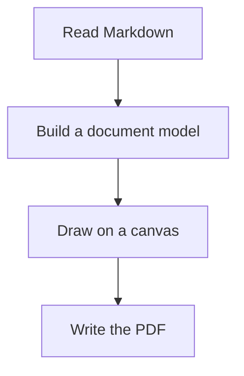

# Sample document

A short document that exercises every element `md2pdf` knows how to draw, so the renderer can be
checked against something real rather than something invented.

## Text

Paragraphs may contain **bold**, *italic*, ***both at once***, `inline code`, and a
[link to the specification](https://spec.commonmark.org/).

Accented characters matter for the cp1252 layer: café, déjà vu, coördinatie, Ångström, ©, ×, —, ….
Arrows are transliterated because the base-14 fonts cannot draw them: → ← ↑ ↓.

## Lists

- A first item that is deliberately long enough to wrap onto a second line, so the hanging indent of
  a continued list item becomes visible in the output
- A second item
  - Nested one level
  - Another nested item
    - And two levels deep
- A fourth item

1. Ordered lists count
2. And keep counting
3. Up to here

## Code

```go
func main() {
        fmt.Println("hello")
}
```

## A diagram



## A table

| Element | Supported | Notes |
|---|---|---|
| Headings | yes | Six levels |
| Tables | yes | Header row repeats across pages |
| Diagrams | optional | Requires an external renderer |

## Inline details

Autolinks stay visible and clickable: <https://a.example>, www.b.example and c@d.example.
A table cell keeps its autolink too:

| Link |
|---|
| <https://a.example> |

Escapes lose their backslashes: \*not\*, 5 \> 3 and a\_b. Entities resolve:
&copy; &amp; &#8594; &#x41;.

A hard line break in a paragraph:  
starts a new line.

- [ ] open
- [x] done
- A hard line break in a list item:  
  starts a new line

> A block quote closes the document, with an accent for good measure: één.

---
